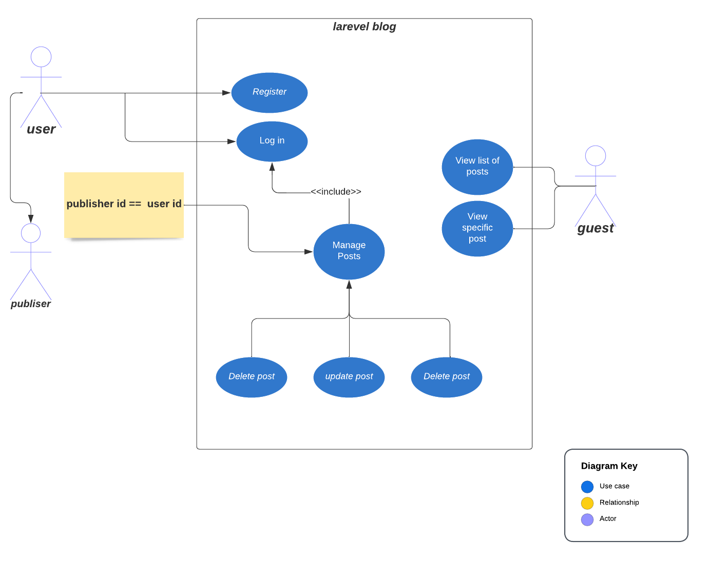

## About Laravel_blog

Laravel_blog is a web application allows there user to:

-   Create blog posts.
-   Read(view) blog posts.
-   Update there OWN blog post.
-   Delete Update there OWN blog post.
-   Create and log in to there accounts.

## Tech used:

-   Laravel V9 : web application framework

## Use Case Diagram:

